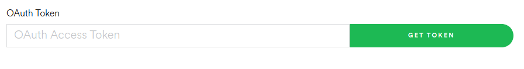
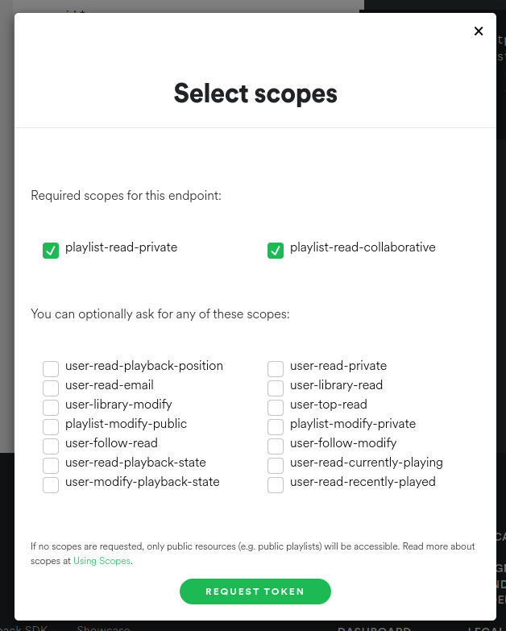

# Spotify archiver
If the little hoarder inside you is like mine you may want to use this code to keep your playlists saved in a confy place of your storage. 

This program uses the Spotify API to save all of your beloved playlists into JSON format, saving also the art of the playlist.

## Usage
To use this code you can import [`archive.py`](./code/archive.py) functions or, if you just want the default archive process, use this command:
```
python code/archive.py -u [user]
```

OUTDATED: 
> In order to make the program run, you'll need to get an authentication token and save it in `.auth/token.txt`. Note that this **is not** the safest approach to authenticating an application. Use at your own risk.

OUTDATED: 
> For more options use the command `python code/archive.py -h`.

Create an .env at the root of the project with the following variables:
```
SPOTIPY_CLIENT_ID=[FILL]
SPOTIPY_CLIENT_SECRET=[FILL]
SPOTIPY_REDIRECT_URI=[FILL]
SPOTIFY_USER=[FILL]
```

## Requirements
This code was made in Python 3.6.9, so it may work well on any 3.x version.

To install Python dependencies, just use the pip command:
```
pip install -r requirements.txt
```

## How to get an authentication token
To get an authentication token in [Spotify's console](https://developer.spotify.com/console/get-playlists/) just click in the **Get Token** button and select `playlist-read-private` and `playlist-read-collaborative` flags, then copy the token into `.auth/token.txt`.





**Warning:** This is not the safest way of authenticating an application. I'm still learning how to automate this in the safest way, but at this point the plain text method is the one used.

# References
- [Progress bar](https://builtin.com/software-engineering-perspectives/python-progress-bar)
- [Export](https://stackoverflow.com/questions/19331497/set-environment-variables-from-file-of-key-value-pairs)
- [Download image](https://stackoverflow.com/questions/30229231/python-save-image-from-url)
- [Scopes](https://developer.spotify.com/documentation/web-api/concepts/scopes)
- [Spotipy: Getting started](https://spotipy.readthedocs.io/en/2.22.1/?highlight=podcast#getting-started)
- [Spotify API: Audio Analysis](https://developer.spotify.com/documentation/web-api/reference/get-audio-analysis)
- [Spotify API: Audio features](https://developer.spotify.com/documentation/web-api/reference/get-audio-features)
- [Spotify API: Getting started with Web API](https://developer.spotify.com/documentation/web-api/tutorials/getting-started)
- []()